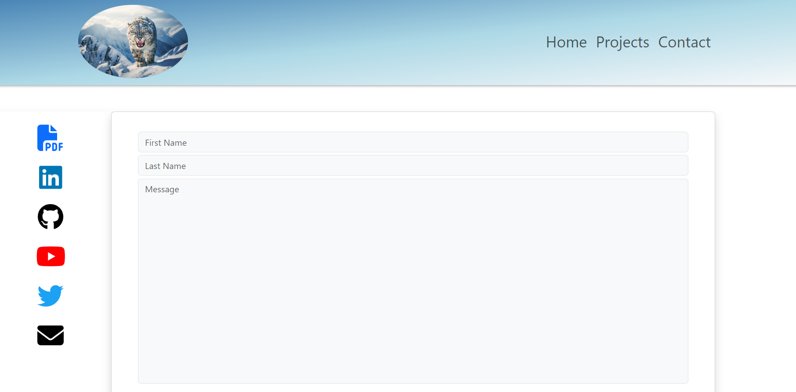

# My Portfolio

Welcome to my portfolio page! This repository contains the source code for my personal portfolio website, showcasing my projects, skills, and experiences.

## Table of Contents

- [Introduction](#introduction)
- [Features](#features)
- [Technologies Used](#technologies-used)
- [Demo](#demo)
- [Installation](#installation)
- [Usage](#usage)
- [Customization](#customization)
- [Deployment](#deployment)
- [License](#license)

## Introduction

This portfolio website serves as a showcase of my work as a developer. It provides visitors with information about me, my skills, and the projects I've worked on.

## Features

- **Projects Showcase:** Display a selection of my projects with descriptions and links.
- **About Me Section:** Provide information about me, my skills, and my experiences.
- **Contact Form:** Allow visitors to get in touch with me easily.
- **Responsive Design:** Ensure the website looks great on various devices and screen sizes.

## Technologies Used

- HTML
- CSS (with Bootstrap for styling)
- JavaScript (with React.js for dynamic content)

## Demo

[Link to live demo](https://filipkotanski.github.io/Portfolio-In-React/) 

## Installation

To run this project locally, follow these steps:

1. Clone this repository to your local machine.
2. Navigate to the project directory.
3. Install dependencies using `npm install`.
4. Start the development server using `npm start`.
5. Open your web browser and visit `http://localhost:3000` to view the website.

## Usage

Once the project is set up, you can:

- Explore the various sections of the portfolio.
- Click on project links to view more details about each project.
- Use the contact form to get in touch with me.

## Customization

Feel free to customize the content, styling, and functionality of this portfolio to fit your own preferences and showcase your unique skills and projects.

## Deployment

To deploy this portfolio website to a hosting service, follow these general steps:

1. Build the project for production using `npm run build`.
2. Upload the build files to your hosting server.
3. Configure your domain to point to the hosting server if necessary.
4. Ensure your hosting environment meets the requirements for running a React.js application.

## License

This project is licensed under the [MIT License](LICENSE).